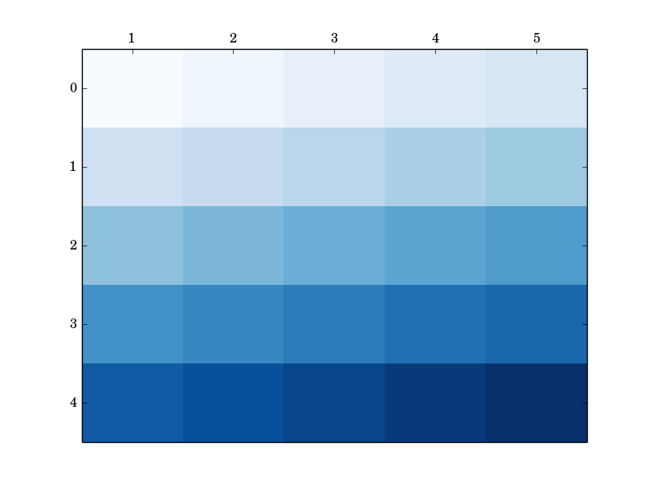
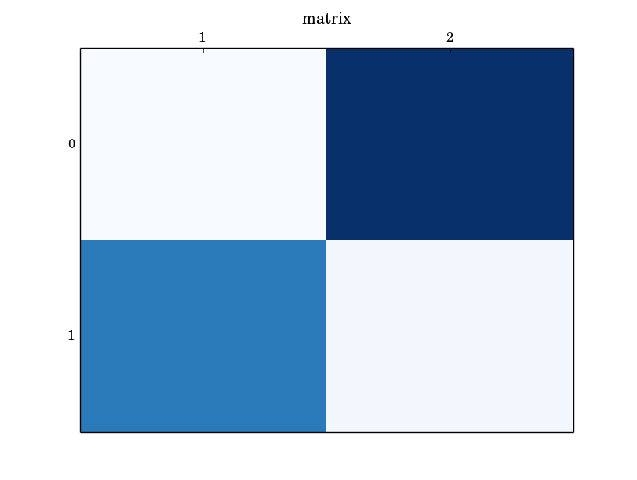
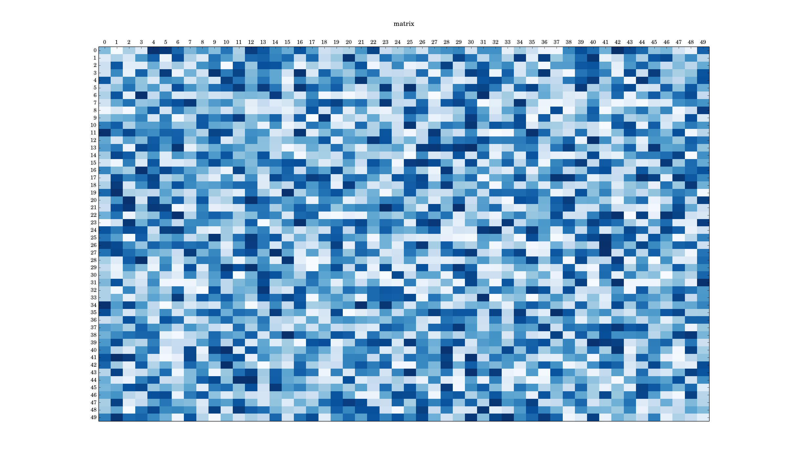

# datavision

Python data visualisation

# introduction

This package provides utilities for data visualisation. For example, it can visualise matrices as colormaps:

# prerequisites

## matplotlib

    sudo pip install matplotlib
    sudo apt-get -y install python3-matplotlib

## shijian

- <https://github.com/wdbm/shijian>
