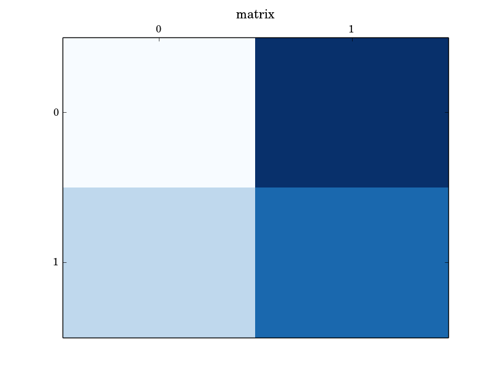

# datavision

Python data visualisation

# quick start

```Bash
sudo apt-get -y install python3
sudo apt-get -y install python3-matplotlib
git clone https://github.com/wdbm/datavision.git
cd datavision/
wget https://raw.githubusercontent.com/wdbm/shijian/master/shijian.py
python examples.py
```

## setup

### Ubuntu

    sudo apt-get -y install python3
    sudo apt-get -y install python3-matplotlib

### OS X

    ruby -e "$(curl -fsSL https://raw.githubusercontent.com/Homebrew/install/master/install)"
    brew install python3
    pip3 install matplotlib

## run

    git clone https://github.com/wdbm/datavision.git
    cd datavision/
    wget https://raw.githubusercontent.com/wdbm/shijian/master/shijian.py
    python3 examples.py

# introduction

## qunti and zus lists

Qunti (群体, groups) are lists that act

- as dictionaries that can contain duplicate keys and
- as sets for the purposes of enabling set-like operations for qunti objects, such as symmetric difference, intersection and update operations.

Qunti are composed of multiple zu (组, group) objects.

### qunti operations

In an update operation, one qunti is used to update another. Any zus in the updating qunti that are not in the updated qunti are appended to the updated qunti. Any zus that are in the updating qunti and the updated qunti replace the corresponding zus in the updated qunti.

The following example illustrates a qunti update operation in which an ```alpha``` zus is replaced and a ```delta``` zus is appended:

```Python
# example qunti update:
a = [['alpha', '10'], ['beta', '20'], ['gamma', '30'], ['gamma', '15']]
b = [['delta', '40'], ['alpha', '50']]
# update of a with b:
a = [['beta', '20'], ['gamma', '30'], ['gamma', '15'], ['delta', '40'], ['alpha', '50']]
```

The following example illustrates qunti symmetric difference, intersection and update operations. In the update operation, two old ```gamma``` zus are replaced by a single new ```gamma``` zu:

```Python
# example qunti symmetric difference, intersection and update:
a = [['alpha', '10'], ['beta', '20'], ['gamma', '30'], ['gamma', '15']]
b = [['delta', '40'], ['alpha', '50'], ['gamma', '25']]
# symmetric difference of a and b:
[['beta', '20'], ['delta', '40']]
# intersection of a and b:
[['alpha', '10'], ['gamma', '30'], ['gamma', '15'], ['alpha', '50'], ['gamma', '25']]
# update of a with b:
a = [['beta', '20'], ['delta', '40'], ['alpha', '50'], ['gamma', '25']]
```

## data visualisation

This module provides utilities for data visualisation. For example, it can visualise matrices as colormaps:





# prerequisites

## Python 3

    sudo apt-get -y install python3

## matplotlib

    #sudo pip install matplotlib
    sudo apt-get -y install python3-matplotlib

## shijian

- <https://github.com/wdbm/shijian>
