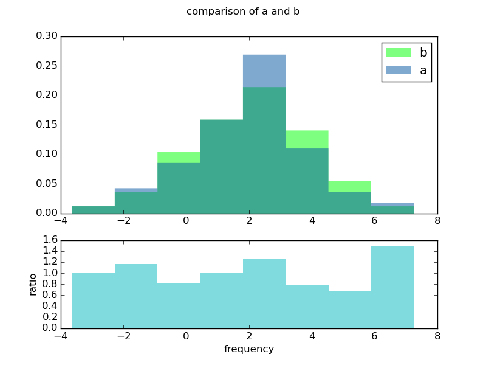
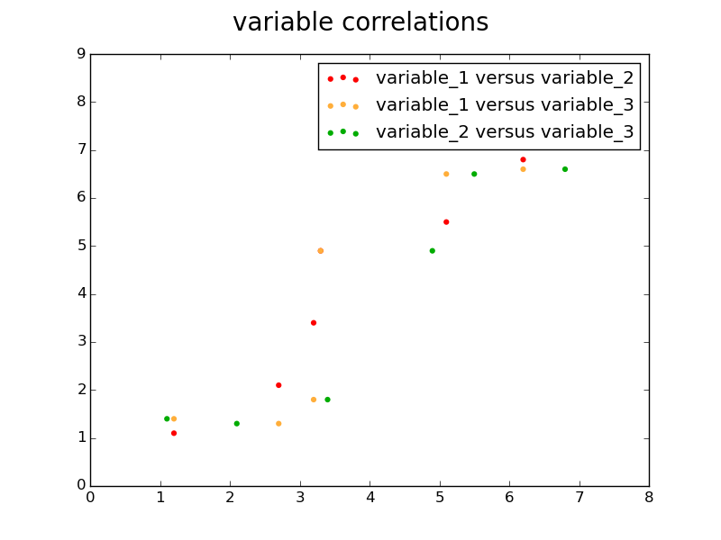
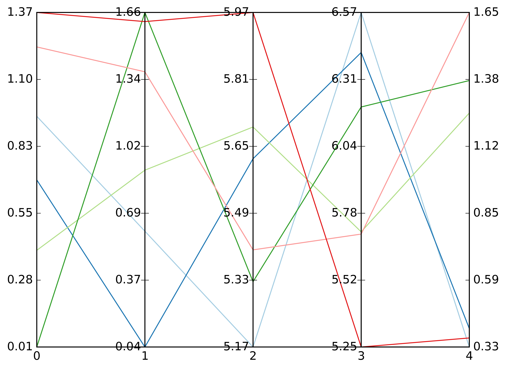
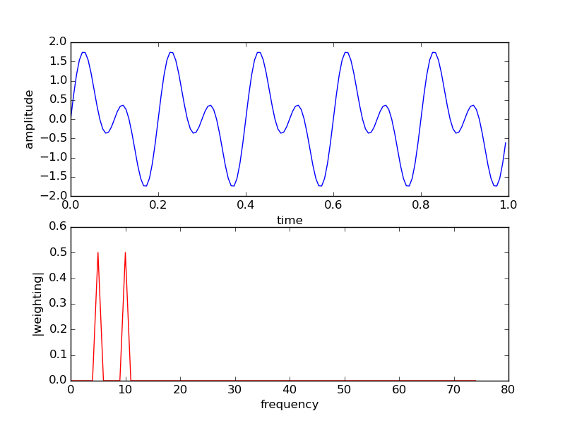
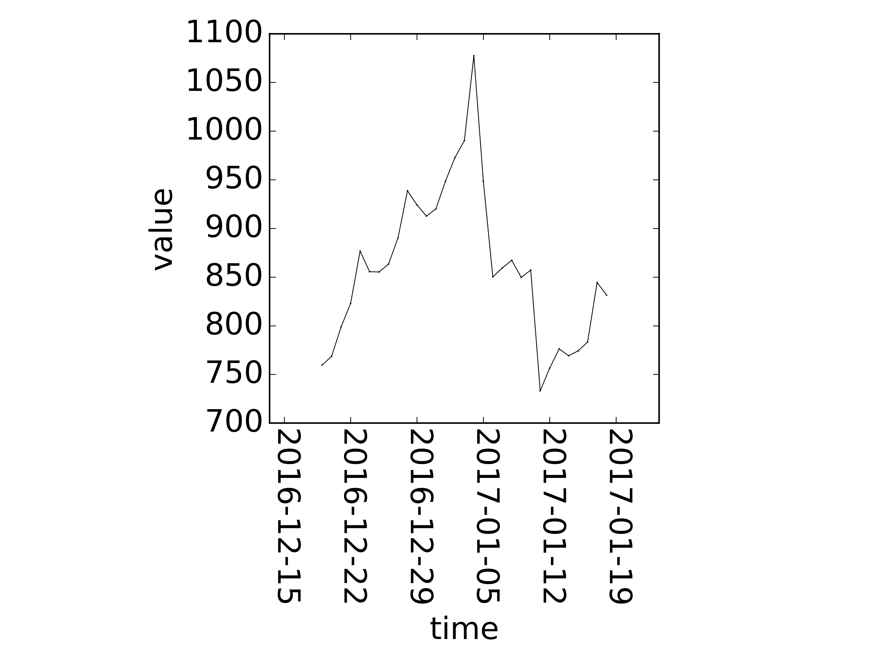
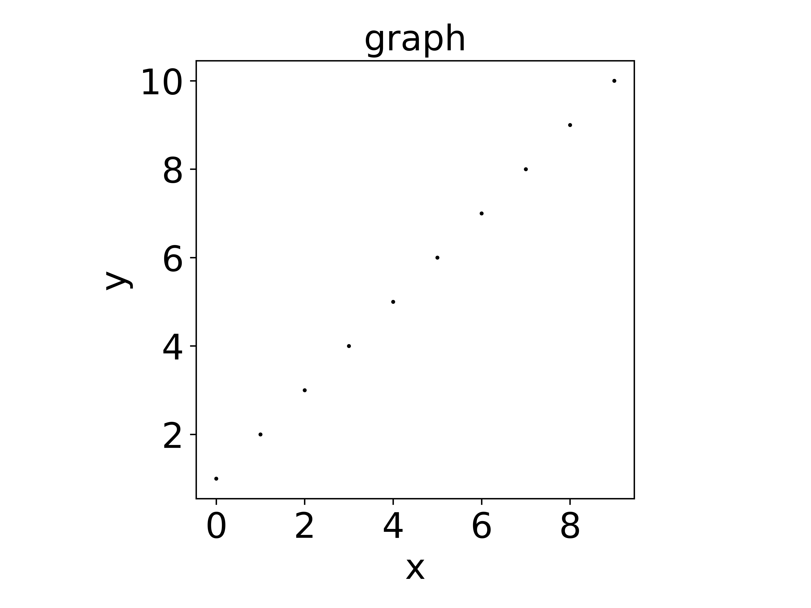
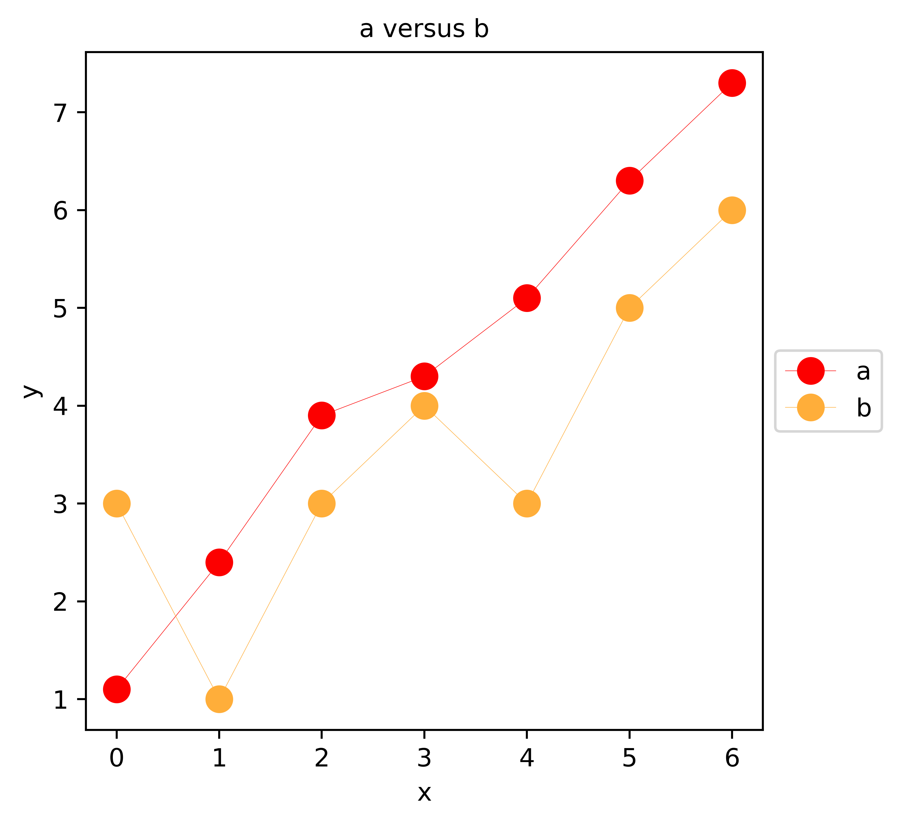
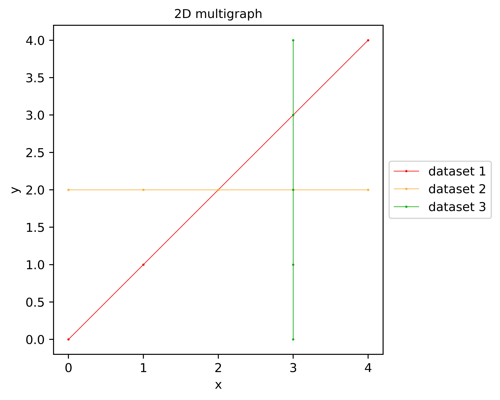
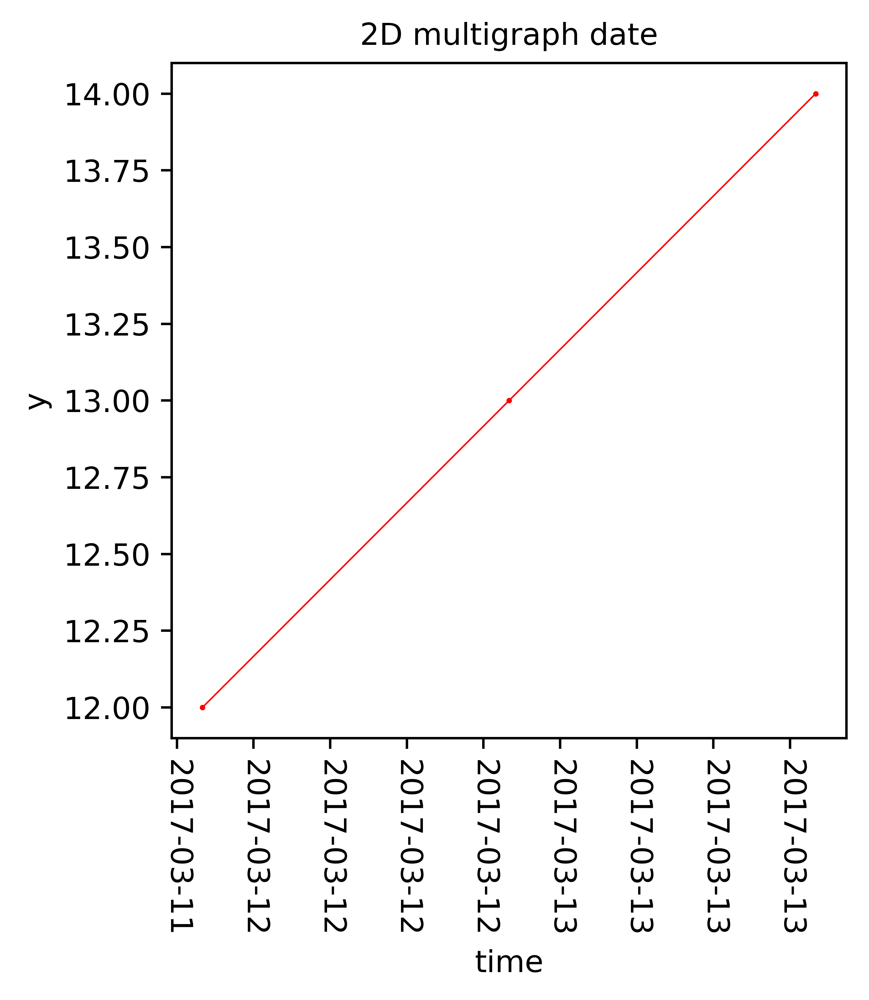
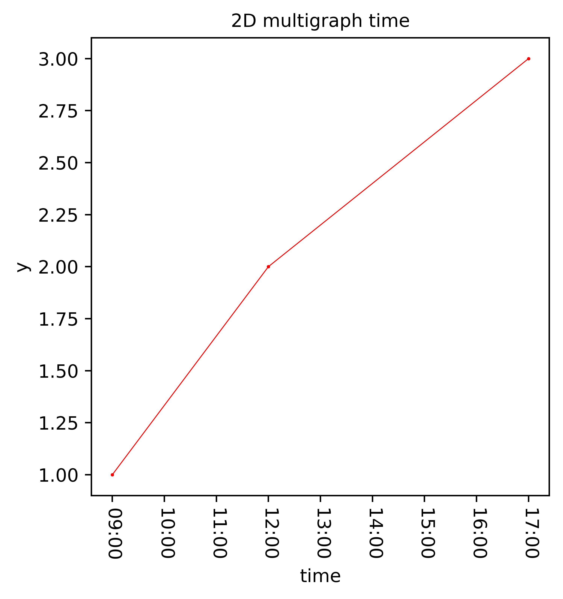

# datavision

Python data visualisation

# setup

```Bash
sudo pip install datavision
```

# introduction

## qunti and zus lists

Qunti (群体, groups) are lists that act

- as dictionaries that can contain duplicate keys and
- as sets for the purposes of enabling set-like operations for qunti objects, such as symmetric difference, intersection and update operations.

Qunti are composed of multiple zu (组, group) objects.

### qunti operations

In an update operation, one qunti is used to update another. Any zus in the updating qunti that are not in the updated qunti are appended to the updated qunti. Any zus that are in the updating qunti and the updated qunti replace the corresponding zus in the updated qunti.

The following example illustrates a qunti update operation in which an `alpha` zus is replaced and a `delta` zus is appended:

```Python
# example qunti update:
a = [['alpha', '10'], ['beta', '20'], ['gamma', '30'], ['gamma', '15']]
b = [['delta', '40'], ['alpha', '50']]
# update of a with b:
a = [['beta', '20'], ['gamma', '30'], ['gamma', '15'], ['delta', '40'], ['alpha', '50']]
```

The following example illustrates qunti symmetric difference, intersection and update operations. In the update operation, two old `gamma` zus are replaced by a single new `gamma` zu:

```Python
# example qunti symmetric difference, intersection and update:
a = [['alpha', '10'], ['beta', '20'], ['gamma', '30'], ['gamma', '15']]
b = [['delta', '40'], ['alpha', '50'], ['gamma', '25']]
# symmetric difference of a and b:
[['beta', '20'], ['delta', '40']]
# intersection of a and b:
[['alpha', '10'], ['gamma', '30'], ['gamma', '15'], ['alpha', '50'], ['gamma', '25']]
# update of a with b:
a = [['beta', '20'], ['delta', '40'], ['alpha', '50'], ['gamma', '25']]
```

## data visualisation

Datavision provides utilities for data visualisation. It can visualise matrices as colormaps:


It can visualise histograms:



It can visualise graphs and histograms in a terminal:

```
   │                                                                            
   ┼+79.548                                                                 ○   
   │                                                                            
   │                                                                ○           
   │                                                                            
   │                                                        ○                   
   │                                                                            
   │                                                ○                           
   ◽       ◽       ◽                       ○                                    
   │                       ◽       ○                                            
   │                       ○       ◽                                            
───○┼──────○───────○───────────────────────◽────────────────────────────────┼───
   │ +0.046                                         ◽               +8.97638    
   │                                                                            
   │                                                        ◽                   
   │                                                                            
   │                                                                ◽           
   ┼-48.228                                                                     
   │                                                                        ◽   
   │                                                                            
```

```
                         │                        
                         ┼+75503.2                
                       ∘∘|∘                       
                      ∘||||∘                      
                      ||||||∘                     
                     ∘|||||||                     
                     ||||||||∘                    
                    ∘|||||||||                    
                    ||||||||||∘                   
                   ∘|||||||||||                   
                   |||||||||||∘                   
                  ∘||||||||||||                   
                  |||||||||||||∘                  
                  ||||||||||||||∘                 
                 ∘|||||||||||||||∘                
                ∘|||||||||||||||||∘               
               ∘|||||||||||||||||||∘              
            ∘∘∘||||||||||┼+1603.2|||∘∘∘           
──┼--------------------------------------------┼──
   -4.69099              │              +4.6147   
```

It can plot all combinations of variables:



It can plot all parallel coordinates:



It can perform FFT:



It can graph time:



# graphs






